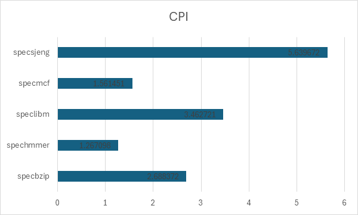

# Εργασία Εισαγωγή στον εξομοιωτή gem5 

**Όνομα:** Φίλιππος  
**Επίθετο:** Σαμαράς  
**Μάθημα:** Αρχιτεκτονική Υπολογιστών  
**Ημερομηνία:** 30/12/2024  
**ΑΕΜ:** 9974

---

## 1. Πρώτο Μέρος  
### 1.1 Βασικές παράμετροι από το αρχείο starter_se.py

Στην εκτέλεση του προγράμματος hello επιλέγουμε για επεξεργαστή τον MinorCPU. Με την επιλογή αυτή έχουμε δύο επίπεδα cache. To L1 το οποίο χωρίζεται σε δύο μέρη με το ένα να είναι για το instraction set και το άλλο για τα δεδομένα. Πιο αναλυτικά ολές οι παράμετροι που τελικά επιλέγονται παρουσιάζονται στον παρακάτω [πίνακα](#τιμές-των-παραμέτρων).

### Τιμές των Παραμέτρων:
| Παράμετρος    | Τιμή           |  
|-------------: |--------------: |  
| CPU           | Minor CPU      |  
| CPU Freq      | 1 GHz          |  
| Mem type      | DDR3_1600_8x8  |  
| Num cores     | 1              |  
| Mem size      | 2 GB           |  
| Mem chanels   | 2              |  
| L1 cache      | icache, dcache |  
| L2 cache      | L2             |
| Cachelinesize | 64             |


### 1.2 Hello Word Files (config.ini config.json stat.txt) 

Τα αρχεία `config.ini` και `config.json` παράγονται μετά την επιτυχή προσομοίωση και μας δίνουν περισσότερες πληροφορίες για την δομή του συστήματος που προσομοιώνεται. Ενώ το `stats.txt` μας δίνει πληροφόριες για την εκτέλεση. 

### α) Config.ini & Config.json
Απο το αρχείο `config.ini` μπορούμε να λάβουμε περισότερες πληροφορίες για την cache, τον επεξεργαστή, την συχνότητα λειτουργίας και τον τύπο του επεξεργαστή. Παρακάτω παρατήθονται τα σχετικά αποκώματα. Ετσι τα αποτελέσματα επιβεβαιωνονται για την σύνθεση του συστήματος.
```ini
    [system.cpu_cluster.cpus.icache]
    type=Cache
    size=49152
    ...

    [system.cpu_cluster.cpus.dcache]
    type=Cache
    assoc=2
    size=32768
    ...

    [system.clk_domain]
    type=SrcClockDomain
    clock=1000
    domain_id=-1
    eventq_index=0
    init_perf_level=0
    voltage_domain=system.voltage_domain

    [system.cpu_cluster.clk_domain]
    type=SrcClockDomain
    clock=1000
    domain_id=-1
    eventq_index=0
    init_perf_level=0
    voltage_domain=system.cpu_cluster.voltage_domain

    [system.cpu_cluster.l2]
    type=Cache
    assoc=16
    size=1048576
    ...
```
### b) Sim_seconds, sim_insts & host_inst_rate.
Παρακάτω δίνονται οι ορισμοί και τα σταττιστικά για την εκτέλεση του προγραμμάτος `hello`:  

1. **sim_seconds**: Η τιμή αυτή αντιπροσωπεύει τον χρόνο που έχει χρειαστεί ο επεξεργαστής που προσομοιώνεται για να εκτελέσει το πρόγραμμα.
2. **sim_insts**: Είναι ο αριθμός των εντολών που εκτελέστηκαν απο τον προσομοιομένο επεξεργαστή.
3. **host_inst_rate**: Είναι ο ρυθμός εκτέλεσης εντολών στο προσομοιομένο επεξεργαστη.  

Οι τιμές των μετρικών αυτών αποτυπώνονται για το προγραμμα `hello` αποτυπώνονται στον παρακάτω [πίνακα](#τιμές).

### Τιμές:
| Παράμετρος     | Τιμή          |  
|-------------   |-------------- |  
| sim_seconds    | 0.000035      |  
| sim_insts      | 5027          |  
| host_inst_rate | 145201        |  

### c) Εντολές που εκτελέστηκαν.
Γενικά υπάρχουν περιπτώσεις στις οποίες μπορεί να διαφέρει ο αριθμός των εκτελεσμένων εντολών από τον συνολικό αριθμό εντολών που εκτελέστικαν. Αυτό συνήθως οφείλεται σε παράγοντες όπως οι ακυρωμένες εντολές που ακυρώνονται πρίν γίνουν commit. Αυτό μπορεί να οφείλεται σε λανθασμένη πρόβλεψη απο τον branch predictor και έτσι να εκτελεστούν κάποιες εντόλες απο τον επεξεργαστή οι οποίες εν τέλη θα ακηρωθούν. Στο πρόγραμμα `hello` που εκτελέστικε υπάρχουν τέτοιες εντόλες. Παρακάτω στον πίνακα φαίνονται ο αριθός των cimmitted εντολών και ακύρωμένων εντολών.  
To αρχείο `stats.txt` μας δίνει δυο διαφορετικές τιμές για τις εκτελεσμένες εντολές. 
#### Committed Instructions (committedInstr):  
Αναφέρεται στον συνολικό αριθμό των **εντολών** που έχουν εκτελεστεί επιτυχώς και έχουν φτάσει στο στάδιο της δέσμευσης (commit) στον επεξεργαστή.


#### Commit Operations (committedOps):  
Αναφέρεται στον αριθμό των **assembly εντολών** (committed operations) εκτελούνται από τον επεξεργαστή.


#### Commited and Discarded instructions.
| committedOPS 	| discardedOPS 	| commitIstr |
|--------------	|--------------	|------------|
| 5831         	| 1300         	| 5027       |


### d) L2 access
O αριθμός των συνολικών προσβάσεων στην μνήμη L2 ήταν `474`. Στην περίπτωση την οποία το νούμερο αυτό δεν ήταν διαθέσιμο ο υπολογισμός του είναι αρκετά απλός. Το μόνο που χρειάζεται είναι να προσθέσουμε τις συνολικές αστοχιές που είχαμε για την **icache** και την **dcache**. Το άθροισμα αυτό μας δίνει την τιμή που χρειαζόμαστε.

### 1.3 
### α) Πληροφορίες για τους διαθέσιμους επεξεργαστές
Ο προσομοιωτής **gem5** προσφέρει διάφορα μοντέλα επεξεργαστών in-order. Παρακάτω παρατηθενται τα διαθέσιμα μοντέλα:  
- SimpleCPU:  Πρόκειται για ένα απλό, λειτουργικό μοντέλο επεξεργαστή in-order, κατάλληλο για περιπτώσεις όπου δεν απαιτείται λεπτομερής προσομοίωση. Διακρίνεται σε τρεις υποκατηγορίες:
    - AtomicSimpleCPU: Χρησιμοποιεί ατομικές προσβάσεις μνήμης, παρέχοντας εκτιμήσεις καθυστερήσεων για την πρόσβαση στην κρυφή μνήμη.
    - TimingSimpleCPU: Χρησιμοποιεί χρονισμένες προσβάσεις μνήμης, αναμένοντας απαντήσεις από το σύστημα μνήμης πριν προχωρήσει, προσομοιώνοντας πιο ρεαλιστικά τις καθυστερήσεις.
- MinorCPU: Πρόκειται για ένα λεπτομερές μοντέλο επεξεργαστή in-order με δυνατότητα χρήσης Pipeline, με δυνατότητα παραμετροποίησης των δομών δεδομένων και της συμπεριφοράς εκτέλεσης.

### b) Fibonacci programm
Παρακάτω παρατιθετε το προγραμμα σε γλωσσα προγραμματισμου c για τη υλοποιήση του αλγορυθμου fibonnacci
```c
    #include <stdio.h>

    int fibonacci(int n) {
        if (n <= 1) {
            return n;
        }
        return fibonacci(n - 1) + fibonacci(n - 2);
    }

    int main(int argc, char**argv) {
        int n = 25;
        printf("Fibonacci(%d) = %d\n", n, fibonacci(n));
        return 0;
    }

```
### simulated seconds in MinorCPU and TimingSimpleCPU for fibbonacci programm 
Για το παραπάνω πρόγραμμα το δοκιμάσαμε για δυο διαφορετικούς επεξεργαστές που μας δίνει επιλογή ο gem5. Στον παρακάτω πίνακα καταγράφεται ο χρόνος που χρειάστικε κάθε επεξεργαστής για να εκτελέσει το πρόγραμμα.  

|             | MinorCPU | TimingSimpleCPU |
|:-----------:|:--------:|:---------------:|
| sim_seconds | 0.002801 |     0.006366    |

### b)
Τα αποτελέσματα της εκτελεσης διαφέρουν λιγο. Ο MinorCPU κάνει λιγότερο χρόνο για να εκτελεσεί το ίδιο πρόγραμμα σε σχέση με τον TimingSimpleCPU γιατί εχεί περισοτερα pipeline stages έτσι μπορεί να ξεκινάει μια εντολή σε κάθε κύκλο.

### c)
Για να σιγκρίνουμε περετέρω τους επεξεργαστές μας επιλέξαμε να αλλάξουμε την τεχνόλογια μνήμης και την συχνότητα του επεξεργαστή. Στους παρακάτω πίνακες φαίνεται η επίδραση της κάθε παραμέτρου στον σύνολικό χρόνο εκτέλεσης του προγράμματος. 
|   MinorCPU  |   2GHz   |   DDR4   |
|:-----------:|:--------:|:--------:|
| sim_seconds | 0.002801 | 0.002800 |  
    
| TimingSimpleCPU |   2GHz   |   DDR4   |
|:---------------:|:--------:|:--------:|
|   sim_seconds   | 0.006366 | 0.006366 |

Αυτό που είναι συμαντικό και πρέπει να παρατηρήσουμε είναι οτι παρόλο που έχει επιλεχθεί πιο γρήγορη τεχνολογία μνήμης ο συνολικος χρόνος εκτέλεσης δεν έχει αλλάξει. Αύτο συμβαίνει διοτί το προγραμμα μας δεν εκμεταλέυεται καθόλου την μνήμη κατα την εκτέλεση του.

## Μέρος 2
### Βήμα 1ο:

### 2.1 Εκτέλεση προγραμμάτων specbzip, specmcf, spechmmer, specsjeng, speclibm.
Με την επιτυχή εκτέλεση των προγραμματών βρέθηκαν τα παρακάτω χαρακτηριστικά για τις caches. Τα στοιχεία έχουν προέλθει από το αρχείο `config.ini`. Είναι κοινά για όλα τα προγράμματα specbzip, specmcf, spechmmer, specsjeng, speclibm που εκτελέσαμε διότι ο επεξεργαστής παρέμεινε ο ίδιος (MinorCPU). 

- L1 dcache
    - size = 65536
    - associativity = 2
        ```ini
        [system.cpu.dcache]
        type=Cache
        size=65536
        assoc = 2
        ...
        ```
- L1 icache 
    - size = 32768
    - associativity = 2
        ```ini
        [system.cpu.icache]
        type=Cache
        size=32768
        assoc=2
        ...
- L2 cache 
    - size = 2097152
    - associativity = 8
        ```ini
        [system.l2]
        type=Cache
        size=2097152
        assoc=8
        ...
- Cache line = 64
    ```ini
    [system]
    cache_line_size = 64
    ...

### 2.2 Αξιολόγιση των στατιστικών για κάθε πρόγραμμα.  
Τα benchmarks δοκιμαστικάν για δύο διαφορετικές τιμές εντολών εκτέλεσης. Μετά την επιτυχή εκτέλεση εγίνε εξαγωγή των τιμών των παραμέτρων μέσα απο το αρχείο stats.txt. Για την καλύτερη οπτικοποίηση των αποτελεσμάτων κατασκευαστίκαν γραφίματα. 

#### For Instructions = 100000000
| Benchmark 	| sim_seconds 	|    CPI    	| d-cache miss_rate 	| i-cache miss_rate 	| l2 cache miss_rate 	|
|:---------:	|:-----------:	|:---------:	|:-----------------:	|:-----------------:	|:------------------:	|
|  specbzip 	|   0.08392   	|  1.679650 	|      0.014798     	|      0.000077     	|      0.282163      	|
| spechmmer 	|   0.059396  	|  1.187917 	|      0.001637     	|      0.000221     	|      0.077760      	|
|  speclibm 	|   0.174671  	|  3.493415 	|      0.060972     	|      0.000094     	|      0.999944      	|
|  specmcf  	|   0.064955  	|  1.299095 	|      0.002108     	|      0.023612     	|      0.055046      	|
| specsjeng 	|   0.513528  	| 10.270554 	|      0.121831     	|      0.000020     	|      0.999972      	|  
  
#### For Instructions = 10000000

| Benchmark   | sim_seconds | cpi | icache miss rate | dcache miss rate | l2 miss rate |
|:---------:  |:-----------:|:---------:  |:----------:|:-----------------:|:------------------:|
| specbzip    | 0.013442    | 2.688372    | 0.00052    | 0.022096          | 0.985545           |
| spechmmer   | 0.006335    | 1.267098    | 0.00112    | 0.003581          | 0.334631           |
| speclibm    | 0.017314    | 3.462721    | 0.000933   | 0.060934          | 0.999417           |
| specmcf     | 0.007807    | 1.561451    | 0.030983   | 0.008978          | 0.183201           |
| specsjeng   | 0.028198    | 5.639672    | 0.000237   | 0.082398          | 0.999088           |  

>Στα παρακάτω διαγράμμα οι τιμές που αποικονίζονται αφορούν την περίπτωση που εκτελέστικαν **Instructions = 10000000**

### CPI  
  
### Excecution Time  
  
### I-cache miss_rate  
  
### D-cache miss_rate  
  
### L2 cache miss_rate  
  

### 2.3 Clock 1GHz or 3GHz

Έγινε εκτέλεση των Benchmarks για επιλογές συχνότητας ρολογίου 1 & 2 GHz. Οι τιμές που βρίσκονται στο stats.txt είναι η `system.clk_domain.clock` και `system.cpu_clk_domain.clock`. Η πρώτη αφορά το clock όλου του επεξεργαστή στο οποίο χρονίζεται ολο το board. Η δεύτερη τιμή αφορά τον πυρήνα του επεξεργαστή που αυτό επιρεάζεται πραγματικά απο το flag `--cpu-clock=....`. Στούς πίνακες παρακάτω φαίνονται οι τιμές αυτών των παραμέτρων. Στην περίπτωση που προσθέσουμε έναν ακόμη επεξεργαστή η συχνότητα του θα είναι ίση με την τιμή που ή θα είναι η default ή θα είναι απο το flag  `--cpu-clock=....`. Σύμφωνα με τα αποτελέσματα από τα αρχεία stats.txt σε όλες τις περιπτώσεις δεν υπάρχει τέλιο scalling. 

#### Πινακας Αποτελεσμάτων για cpu-clock=default (2GHz)
|                   |  system.clk_domain.clock 	| system.cpu_clk_domain.clock 	|
|------------------	|-------------------------	|-----------------------------	|
| specbzip         	| 1000                    	| 500                        	|
| spechmmer        	| 1000                    	| 500                        	|
|  specmcf         	| 1000                    	| 500                        	|
| specsjeng        	| 1000                    	| 500                        	|
| speclibm         	| 1000                    	| 500                        	|

#### Πινακας Αποτελεσμάτων για cpu-clock=1GHz
|                    | system.clk_domain.clock 	| system.cpu_clk_domain.clock 	|
|------------------	|-------------------------	|-----------------------------	|
| specbzip         	| 1000                    	| 1000                        	|
| spechmmer        	| 1000                    	| 1000                        	|
|  specmcf         	| 1000                    	| 1000                        	|
| specsjeng        	| 1000                    	| 1000                        	|
| speclibm         	| 1000                    	| 1000                        	|  
#### Πινακας Αποτελεσμάτων για cpu-clock=3GHz
|                 | system.clk_domain.clock 	| system.cpu_clk_domain.clock 	|
|------------------	|-------------------------	|-----------------------------	|
| specbzip         	| 1000                    	| 333                         	|
| spechmmer        	| 1000                    	| 333                         	|
|  specmcf         	| 1000                    	| 333                         	|
| specsjeng        	| 1000                    	| 333                         	|
| speclibm         	| 1000                    	| 333                         	|
  
### 2.4 Change the mem type for specbzip

Επιλέχθικε το benchmark specmcf για την δοκιμή της πιο γρήγορης μνήμης. Οπως φαίνεται και απο στον παρακάτω πίνακα υπάρχει σχετίκα μικρή διαφόρα στον χρόνο για τον ίδιο αριθμό εντολών. Τα αποτελέσματα του sim_seconds για την κάθε σύνθεση φαίνονται στον παρακάτω πίνακα. Αυτό συμβαίνει λογο του οτί το benchmark specmcf δεν εκτεμεταλεύεται την μνήμη για την εκτέλεση του. Αυτό έχει αποτέλεσμα να μην υπάρχεί διαφορά στους τελικούς χρόνους εκτέλεσης.

#### Simutalted seconds for diferrent memory setup. 
|         	| DDR3_1600_8x8 	| DDR3_2133_8x8 	|
|---------	|:---------------:	|:---------------:	|
| specmcf 	| 0.064955      	| 0.064892      	|  

### Βήμα 2ο:
### Ευρευση της επιρροής κάθε παράγοντα στο CPI
Λογω του μεγάλου πλήθους των συνδιασμών επιλέχθηκε να δοκιμαστεί να μεταβάλεται μία παράμετρος και οι υπόλοιπες να παραμένουν ιδίες με τις default. Παρακάτω παρατίθενται τα γραφίματα που δείχνουν την επιρροή κάθε παραμέτρου στο cpi του προγράμματος. Τα bechmarks εγινε εκτελεση για Ι 10000000  

### Τα διαγραμματα αφορούν σύνθεση   
Σε κάθε διαγραμμα αποτυπώνεται μια δοκιμή στην οποιά κρατάμε σταθερά ολα τα υπολοιπα και μεταβάλλουμε μόνο μίαν παραμετρόν.

| **Parameter**            | **Value**        |  
|:------------------------:|:----------------:|  
| **I-Cache Size**         | 32 KB            |  
| **I-Cache Associativity**| 2                |  
| **D-Cache Size**         | 64 KB            |  
| **D-Cache Associativity**| 2                |  
| **L2 Cache Size**        | 2 MB             |  
| **L2 Cache Associativity**| 8               |  
| **Cache Line Size**      | 64 bytes         |  
### Στατιστικά για Specbzip & Speclibm  
----
### Specbzip
#### Για μεταβολή του cacheline size
| **Cacheline size**               | **CPU CPI**  | **DCache Miss Rate** | **ICache Miss Rate** | **L2 Miss Rate** |
|-------------------------------|--------------|----------------------|----------------------|------------------|
| 16    | 3.804921     | 0.055506             | 0.000656             | 0.993989         |
| 32    | 3.005237     | 0.037665             | 0.000581             | 0.990034         |
| 64    | 2.279221     | 0.021251             | 0.000520             | 0.985545         |
| 128     | 2.304889     | 0.014102             | 0.000450             | 0.982872         |
| 256     | 2.212689     | 0.010056             | 0.000432             | 0.983904         |

#### Για μεταβολή του dcache assoc
| **D cache association**               | **CPU CPI**  | **DCache Miss Rate** | **ICache Miss Rate** | **L2 Miss Rate** |
|-------------------------------|--------------|----------------------|----------------------|------------------|
| 2        | 2.279221     | 0.021251             | 0.000520             | 0.985545         |
| 4        | 2.279221     | 0.021249             | 0.000520             | 0.985627         |
| 8         | 2.279221     | 0.021249             | 0.000520             | 0.985627         |
| 16         | 2.279221     | 0.021249             | 0.000520             | 0.985627         |

#### Για μεταβολή του d cache size  
| **D cache size**               | **CPU CPI**  | **DCache Miss Rate** | **ICache Miss Rate** | **L2 Miss Rate** |
|-------------------------------|--------------|----------------------|----------------------|------------------|
| 16KB          | 2.282948     | 0.021584             | 0.000523             | 0.968619         |
| 32KB          | 2.279975     | 0.021315             | 0.000520             | 0.982521         |
| 64KB          | 2.279221     | 0.021251             | 0.000520             | 0.985545         |
| 128KB          | 2.279275     | 0.021252             | 0.000520             | 0.985676         |


#### Για μεταβολή του I cache size  
| **I cache size**               | **CPU CPI**  | **DCache Miss Rate** | **ICache Miss Rate** | **L2 Miss Rate** |
|-------------------------------|--------------|----------------------|----------------------|------------------|
| 16KB          | 2.277211     | 0.021258             | 0.000574             | 0.985163         |
| 32KB          | 2.279221     | 0.021251             | 0.000520             | 0.985545         |
| 64KB          | 2.278125     | 0.021247             | 0.000475             | 0.985904         |
| 128KB         | 2.278351     | 0.021248             | 0.000460             | 0.986035         |  


#### Για μεταβολή του L2 association

| **L2 association**               | **CPU CPI**  | **DCache Miss Rate** | **ICache Miss Rate** | **L2 Miss Rate** |
|-------------------------------|--------------|----------------------|----------------------|------------------|
| 2          | 2.279163     | 0.021248             | 0.000520             | 0.988474         |
| 4          | 2.279221     | 0.021251             | 0.000520             | 0.985545         |
| 8          | 2.276082     | 0.021249             | 0.000520             | 0.983371         |
| 16          | 2.276371     | 0.021259             | 0.000520             | 0.983363         |
| 32          | 2.276015     | 0.021252             | 0.000520             | 0.983587         |  


#### Για μεταβολή του L2 size
| **L2 size**               | **CPU CPI**  | **DCache Miss Rate** | **ICache Miss Rate** | **L2 Miss Rate** |
|-------------------------------|--------------|----------------------|----------------------|------------------|
| 512KB           | 2.293280     | 0.021258             | 0.000520             | 0.997560         |
| 1MB           | 2.288891     | 0.021258             | 0.000520             | 0.992067         |
| 2MB           | 2.279221     | 0.021251             | 0.000520             | 0.985545         |
| 4MB           | 2.254992     | 0.021234             | 0.000520             | 0.970933         |

### Speclibm

#### Για μεταβολή του cacheline size
| **Cacheline size**               | **CPU CPI**  | **DCache Miss Rate** | **ICache Miss Rate** | **L2 Miss Rate** |
|-------------------------------|--------------|----------------------|----------------------|------------------|
| 16 | 3.804921 | 0.055506 | 0.000656 | 0.993989 |
| 32 | 3.005237 | 0.037665 | 0.000581 | 0.990034 |
| 64 | 2.279221 | 0.021251 | 0.000520 | 0.985545 |
| 128 | 2.304889 | 0.014102 | 0.000450 | 0.982872 |
| 256 | 2.212689 | 0.010056 | 0.000432 | 0.983904 |


#### Για μεταβολή του dcache assoc
| **D cache association**               | **CPU CPI**  | **DCache Miss Rate** | **ICache Miss Rate** | **L2 Miss Rate** |
|-------------------------------|--------------|----------------------|----------------------|------------------|
| 2 | 2.279221 | 0.021251 | 0.000520 | 0.985545 |
| 4 | 2.279221 | 0.021249 | 0.000520 | 0.985627 |
| 8 | 2.279221 | 0.021249 | 0.000520 | 0.985627 |
| 16 | 2.279221 | 0.021249 | 0.000520 | 0.985627 |


#### Για μεταβολή του d cache size  
| **D cache size**               | **CPU CPI**  | **DCache Miss Rate** | **ICache Miss Rate** | **L2 Miss Rate** |
|-------------------------------|--------------|----------------------|----------------------|------------------|
| 16KB | 2.282948 | 0.021584 | 0.000523 | 0.968619 |
| 32KB | 2.279975 | 0.021315 | 0.000520 | 0.982521 |
| 64KB | 2.279221 | 0.021251 | 0.000520 | 0.985545 |
| 128KB | 2.279275 | 0.021252 | 0.000520 | 0.985676 |


#### Για μεταβολή του I cache size  
| **I cache size**               | **CPU CPI**  | **DCache Miss Rate** | **ICache Miss Rate** | **L2 Miss Rate** |
|-------------------------------|--------------|----------------------|----------------------|------------------|
| 16KB | 2.277211 | 0.021258 | 0.000574 | 0.985163 |
| 32KB | 2.279221 | 0.021251 | 0.000520 | 0.985545 |
| 64KB | 2.278125 | 0.021247 | 0.000475 | 0.985904 |
| 128KB | 2.278351 | 0.021248 | 0.000460 | 0.986035 |


#### Για μεταβολή του L2 association

| **L2 association**               | **CPU CPI**  | **DCache Miss Rate** | **ICache Miss Rate** | **L2 Miss Rate** |
|-------------------------------|--------------|----------------------|----------------------|------------------|
| 2 | 2.279163 | 0.021248 | 0.000520 | 0.988474 |
| 4 | 2.279221 | 0.021251 | 0.000520 | 0.985545 |
| 8 | 2.276082 | 0.021249 | 0.000520 | 0.983371 |
| 16 | 2.276371 | 0.021259 | 0.000520 | 0.983363 |
| 32 | 2.276015 | 0.021252 | 0.000520 | 0.983587 |


#### Για μεταβολή του L2 size
| **L2 size**               | **CPU CPI**  | **DCache Miss Rate** | **ICache Miss Rate** | **L2 Miss Rate** |
|-------------------------------|--------------|----------------------|----------------------|------------------|
| 512KB | 2.293280 | 0.021258 | 0.000520 | 0.997560 |
| 1MB | 2.288891 | 0.021258 | 0.000520 | 0.992067 |
| 2MB | 2.279221 | 0.021251 | 0.000520 | 0.985545 |
| 4MB | 2.254992 | 0.021234 | 0.000520 | 0.970933 |

---
### Αναλυτικά Γραφίματα για όλα τα benchmarks. 


### Συναρτηση κοστους 
Για την συνάρτηση κόστους δίνουμε μεγαλύτερη βαρύτητα στον παραγόντα μεγέθους της μνήμης cache. Ειναι γνωστό οτι το κόστος παραγωγής μιας L1 cache είναι μεγαλυτερο απο μια L2 cache ισχυει οτι α1>α4. Επιπλέον πολλαπλασιάζοντας με μία δύναμη του δέκα κάθε παράγοντα επιτυνχάνουμε να φέρουμε τα μεγέθοι μας στην ίδια κλήμακα. Οι παραγοντες α1 εως α5 είναι παράγοντες κοστους για τους οποίους ισχυεί οτι α1>α2>α3>α4>α5. 
$$
\text{costFunction} = ((l1d\_size) \cdot 10^3 \cdot a1) + ((l1i\_size) \cdot 10^3 \cdot a1) + (l2\_size \cdot a4) + (cacheline\_size \cdot 10^6 \cdot a5) + (l1i\_assoc \cdot 10^6 \cdot a2) + (l1d\_assoc \cdot 10^6 \cdot a2) + (l2\_assoc \cdot 10^6 \cdot a3)
$$

